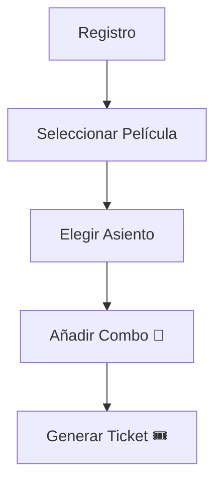

# 🎥 Capybara Films - Proyecto Tercer Semestre
**¡Bienvenido al sistema de gestión de cine más adorable del mundo!**

Desarrollado por Carpinchos Programando 
💻 en Python.

---

## ✨ Funcionalidades
### **📌 Registro de usuarios**
### **🎬 Selección de películas + asignación automática de sala**
### **💺 Elección de asientos (Premium 🛋️ o Común 🪑)**
### **🎟️ Compra de entradas**
### **🍿 Combos de Candy (bebidas + pochoclos)**
### **🖨️ Generación de tickets con:**
  - Película
  - Asiento
  - Combo
  - Precio total

---

## 🛠️ Tecnologías
| Área          | Tecnología      |
|---------------|-----------------|
| **Lenguaje**  | Python 🐍       |
| **Backend**   | Flask 🌐        |
| **Base de Datos** | PostgreSQL 🐘 |

---

## 📥 Instalación
1. Clona el repositorio:

       git clone https://github.com/CapybaraFilms_ProyectoTercerSemestre.git
2.  Accede al directorio:

        cd CapybaraFilms_ProyectoTercerSemestre
3.  Entorno virtual (recomendado):

        python -m venv venv
        source venv/bin/activate  # Windows: venv\Scripts\activate
4.  Instala dependencias:

        pip install -r requirements.txt
5.  ¡Ejecuta la app!

        python main.py

---

## 🎮 Uso

## 🤝 Contribuciones
### ¡Aceptamos *pull* requests con:
  - 🔧 Correcciones
  - ✨ Mejoras de diseño
  - 🚀 Nuevas features

---

## ¿Listo para disfrutar del cine? 🎬🍿
## ¡Gracias por elegir Capybara Films!  💙
